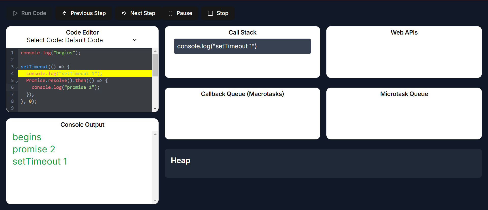
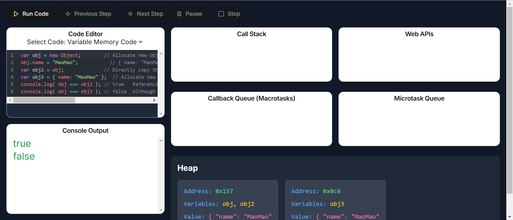

# JavaScript Event Loop 練習

參考 - [JavaScript Visualized - Event Loop, Web APIs, (Micro)task Queue](https://www.youtube.com/watch?v=eiC58R16hb8)

JavaScript 的事件循環（Event Loop）是理解 JavaScript 非同步行為的關鍵。
這個練習是幫助了解事件循環的運作方式，包括調用`堆疊（Call Stack）`、`Web APIs`、`任務隊列（Task Queue）`和`微任務隊列（MicroTask Queue）`。

## Event Loop



上圖展示了 JavaScript 事件循環的整體架構：

- `Call Stack（呼叫堆疊）`：JavaScript 代碼在此執行，處理同步任務。
- `Web APIs`：瀏覽器提供的 API，用於處理異步操作，如 setTimeout、DOM 事件、AJAX 請求等。
- `Task Queue`（任務隊列）：存放來自 Web APIs 的回調函數，等待呼叫堆疊清空後執行。
- `MicroTask Queue（微任務隊列）`：存放 Promise 的回調函數，優先於任務隊列執行。

### 事件循環的流程如下

1.執行呼叫堆疊中的同步代碼：從頂部開始執行，直到堆疊為空。
2.處理異步任務：遇到異步操作時，將其委派給相應的 Web API。
3.回調函數入隊：Web API 完成任務後，將回調函數放入任務隊列或微任務隊列。
4.檢查微任務隊列：在呼叫堆疊清空後，事件循環首先執行微任務隊列中的所有任務。
5.執行任務隊列中的回調函數：微任務執行完畢後，再從任務隊列中取出回調函數執行。

### Demo

```javascript
console.log("begins");

setTimeout(() => {
  console.log("setTimeout 1");
  Promise.resolve().then(() => {
    console.log("promise 1");
  });
}, 0);

new Promise(function (resolve, reject) {
  console.log("promise 2");
  setTimeout(function () {
    console.log("setTimeout 2");
    resolve("resolve 1");
  }, 0);
}).then((res) => {
  console.log("dot then 1");
  setTimeout(() => {
    console.log(res);
  }, 0);
});
```

### 輸出順序

```javascript
begins
promise 2
setTimeout 1
promise 1
setTimeout 2
dot then 1
resolve 1
```

---

## Variable Memory Code



### 在 JavaScript 中，變數的記憶體分配主要有兩種方式

- 原始類型（Primitive Types）：儲存在堆疊（Stack）記憶體中，直接保存變數的值。
- 引用類型（Reference Types）：物件儲存在堆（Heap）記憶體中，變數保存指向物件的引用（即物件在記憶體中的位址）。

### Demo

```javascript
var obj = new Object();          // 在堆記憶體中分配一個新物件的位址
obj.name = "毛毛";             // 給物件添加屬性 { name: "MaoMao" }
var obj2 = obj;                  // 直接複製引用，obj2 指向與 obj 相同的物件
var obj3 = { name: "毛毛" };   // 在堆記憶體中分配一個新物件 { name: "MaoMao" }
console.log(obj === obj2);       // true   引用相同的物件
console.log(obj === obj3);       // false  雖然物件內容相同，但引用不同
```

### 解釋

- `obj`：使用 `new Object()` 建立一個新物件，在堆記憶體中分配空間，`obj` 保存該物件的引用。
- `obj2`：將 `obj` 賦值給 `obj2`，複製的是引用，因此 `obj2` 與 `obj` 指向相同的物件。
- `obj3`：使用物件字面量 { name: "MaoMao" } 建立一個新物件，分配了新的記憶體位址。
因此：

`obj === obj2` 為 true，因為它們引用相同的物件。
`obj === obj3` 為 false，因為它們引用不同的物件，雖然物件的內容相同。

### 關鍵點

原始類型：包括 `Number`、`String`、`Boolean`、`Null`、`Undefined`、`Symbol`，直接儲存在堆疊記憶體中，保存的是實際的值。
引用類型：包括 `Object`、`Array`、`Function` 等，儲存在堆記憶體中，變數保存的是物件的引用。
變數賦值：對於原始類型，賦值時會複製值本身；對於引用類型，賦值時複製的是引用位址。

### 記憶體示意圖

以下是變數在記憶體中的分配示意圖：

堆疊記憶體（Stack）：儲存變數名稱和原始值或引用位址。
堆記憶體（Heap）：儲存物件的實際內容。

### 注意事項

修改 `obj` 或 `obj2` 的屬性，會影響到彼此，因為它們引用的是同一個物件。
修改 `obj3` 的屬性，不會影響到 `obj` 或 `obj2`，因為它們引用的是不同的物件。

### 延伸範例

```javascript
var obj = new Object();          // 在堆記憶體中分配一個新物件的位址
obj.name = "毛毛";             // 給物件添加屬性 { name: "MaoMao" }
var obj2 = obj;                  // 直接複製引用，obj2 指向與 obj 相同的物件
var obj3 = { name: "毛毛" };   // 在堆記憶體中分配一個新物件 { name: "MaoMao" }
console.log(obj === obj2);       // true   引用相同的物件
console.log(obj === obj3);       // false  雖然物件內容相同，但引用不同

obj2.name = "Kitty";
console.log(obj.name);   // 輸出 "Kitty"
console.log(obj3.name);  // 輸出 "MaoMao"

```

由於 `obj` 和 `obj2` 引用同一個物件，修改其中一個的屬性會影響另一個。
`obj3` 是一個獨立的物件，修改 `obj` 或 `obj2` 不會影響到它。
